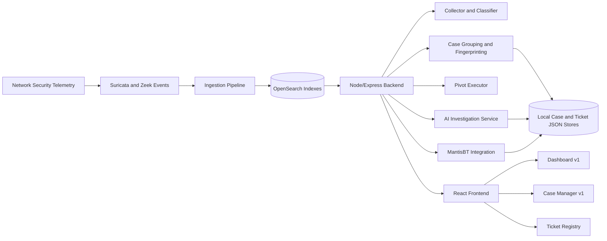
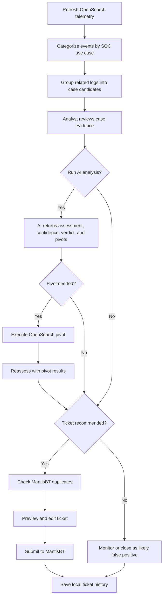
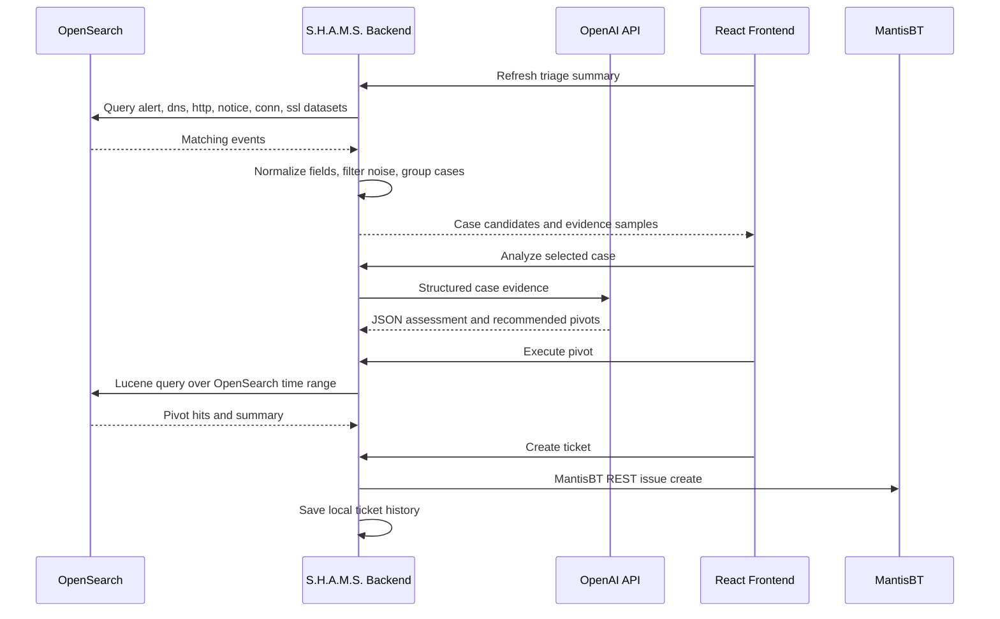
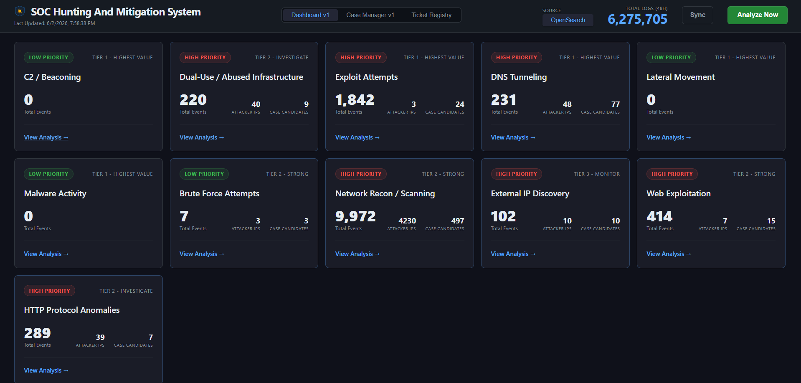
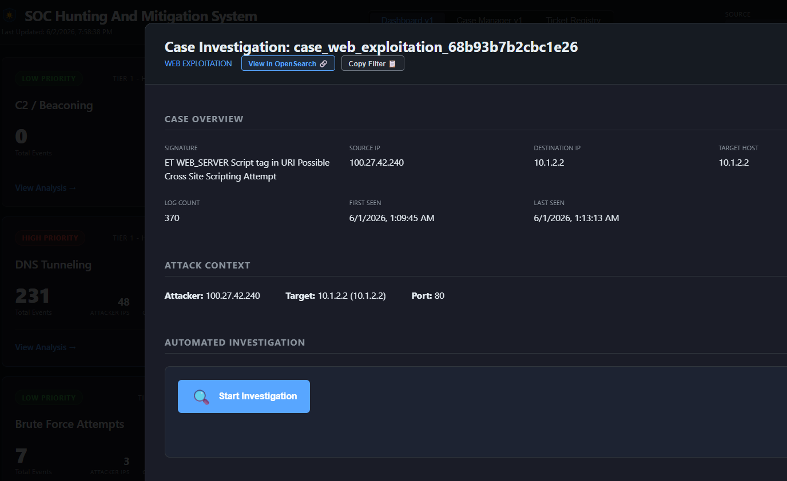
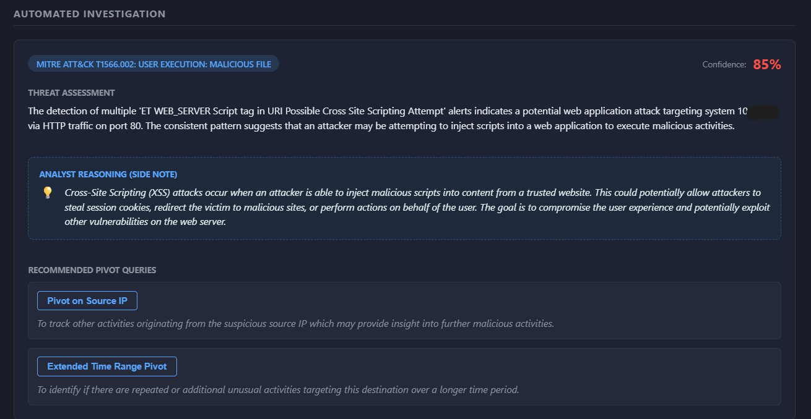
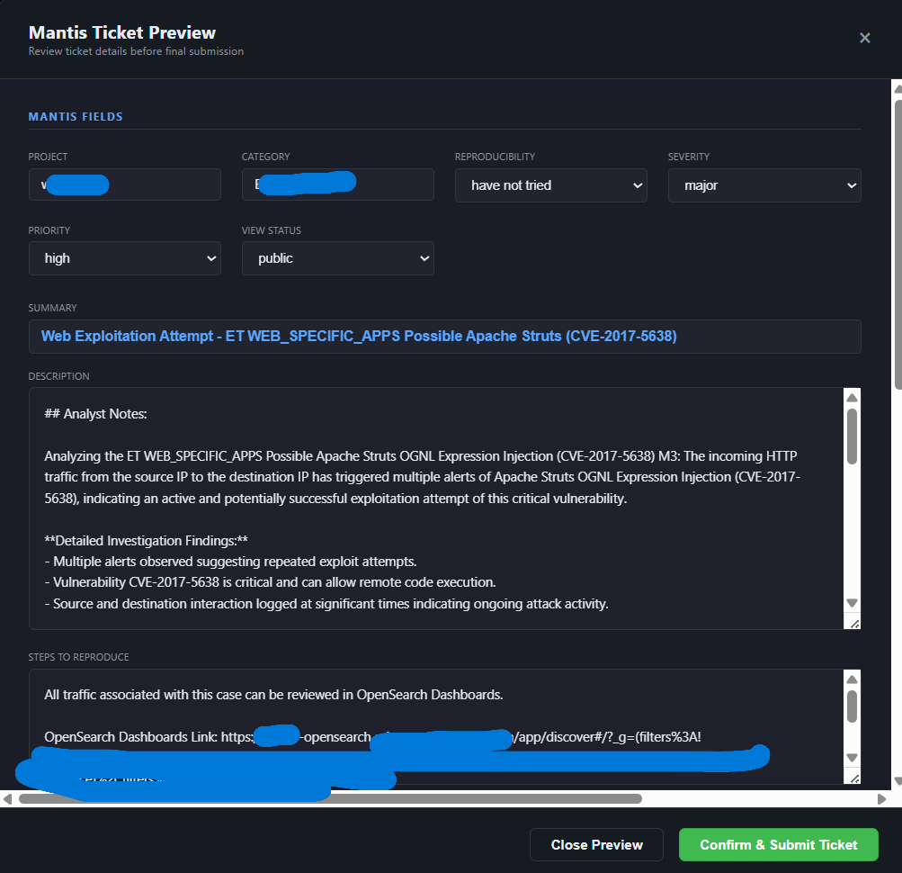

# S.H.A.M.S. - SOC Hunting and Mitigation System

**AI-assisted SOC triage platform for OpenSearch telemetry, analyst case grouping, investigation pivots, and MantisBT ticket workflows.**

S.H.A.M.S. turns high-volume security telemetry into grouped, explainable investigation cases. It was built as a senior cybersecurity capstone and is presented here as a portfolio case study in SOC automation, alert triage, and security-engineering workflow design.

> This repository documents a finished prototype. It is not a production SOC platform, managed detection service, or replacement for analyst judgment.

## Executive Summary

Security teams often have enough logs but not enough time to convert those logs into clear, evidence-backed decisions. S.H.A.M.S. addresses that gap by collecting OpenSearch-backed Suricata and Zeek telemetry, grouping related events into case candidates, using AI to assist with triage reasoning, executing follow-up pivots, and preparing MantisBT tickets with structured evidence.

The project demonstrates a practical SOC workflow:

- Collect and normalize telemetry from OpenSearch.
- Classify activity into investigation categories such as C2, malware, brute force, DNS tunneling, scanning, exploit attempts, and web exploitation.
- Group related logs into case candidates with stable fingerprints.
- Use AI to summarize evidence, recommend pivots, and produce an analyst-readable verdict.
- Preserve ticket and case history so prior decisions can inform future triage.
- Keep the analyst in control of final ticket review and submission.

## Security Problem

Raw alert dashboards can overwhelm junior analysts. A single incident may appear as many logs across Suricata alerts, Zeek DNS records, HTTP records, SSL metadata, notices, and connection events. Analysts must repeatedly answer the same questions:

- Which alerts are worth investigating?
- Are multiple events part of the same case?
- What evidence supports escalation, monitoring, or closure?
- Which pivot should be checked next?
- Has this source IP, destination IP, host, signature, or URL appeared in previous tickets?
- Can a ticket be created with enough context for another analyst to act on it?

S.H.A.M.S. was designed around that workflow. It does not claim to detect everything. It focuses on reducing repetitive triage work and making the evidence trail easier to inspect.

## Architecture



## SOC Workflow



## Telemetry Workflow



## Technology Stack

| Area | Technologies |
| --- | --- |
| Frontend | React, Create React App, CSS |
| Backend | Node.js, Express, JavaScript ES modules |
| Telemetry | OpenSearch, OpenSearch Dashboards links, Suricata-style alerts, Zeek DNS/HTTP/SSL/notice/conn records |
| AI workflow | OpenAI chat completions with structured JSON responses |
| Ticketing | MantisBT REST API |
| Storage | Local JSON files for generated triage summaries, case manager status, case registry, and ticket history |
| Tooling | npm, PowerShell helper scripts |

## Core Features

- **OpenSearch telemetry collection**: Queries `alert`, `dns`, `http`, `notice`, `conn`, and `ssl` datasets and stores summarized triage output.
- **Security-category classification**: Covers C2/beaconing, malware, exploit attempts, DNS tunneling, lateral movement, brute force, reconnaissance, web exploitation, HTTP protocol anomalies, dual-use infrastructure, and external IP discovery.
- **Case grouping**: Groups events into deterministic case records with timestamps, log counts, source/destination indicators, ports, hosts, URLs, DNS queries, signatures, and sample evidence.
- **Dashboard v1**: Provides category summaries, case evidence, AI analysis, pivot execution, duplicate checks, and ticket preview/submission.
- **Case Manager v1**: Runs an automated last-hour OpenSearch grouping job, ranks cases locally, investigates the top cases with AI, executes limited pivots, and displays live progress.
- **Pivot execution**: Runs AI-suggested OpenSearch pivots across source IP, destination IP, signature, CVE, destination port, HTTP URL, host, DNS name, TLS SNI, and extended time windows.
- **MantisBT workflow**: Checks likely duplicates, creates evidence-backed tickets, syncs user ticket history, and stores local analyst memory.
- **Evidence links**: Generates OpenSearch Dashboards Discover URLs for case review where environment configuration supports it.

## AI-Assisted Triage Workflow

The AI layer is intentionally scoped. It receives structured case evidence and returns JSON containing:

- Initial threat assessment and analyst reasoning.
- Verdict candidates: `ESCALATE`, `LIKELY_FALSE_POSITIVE`, or `SUSPICIOUS_MONITOR`.
- Confidence score and attack classification.
- Ticket recommendation.
- Up to two recommended pivots for follow-up investigation.

The application then executes approved pivots through OpenSearch and can reassess the case using the pivot results. The analyst still reviews the ticket preview before submission.

## MantisBT Ticketing Workflow

S.H.A.M.S. integrates with MantisBT through the REST API:

1. Build a case fingerprint from selected telemetry.
2. Search recent MantisBT tickets for likely duplicates using IPs, signature, destination, host, and category.
3. Generate a ticket preview containing assessment, evidence, pivots, OpenSearch query/link, severity, priority, and additional context.
4. Allow the analyst to edit ticket fields.
5. Submit the issue to MantisBT.
6. Save local ticket history for future triage context.

## Screenshots

### Dashboard Overview



Dashboard v1 summarizes OpenSearch-backed alert categories and grouped investigation cases.

### Case Evidence



Grouped telemetry preserves source, destination, signature, timing, and sample evidence in one analyst-reviewable case.

### AI Analysis and Pivot Results



AI-assisted triage provides bounded reasoning, confidence, verdict guidance, and follow-up OpenSearch pivots.

### Ticket Registry



The Ticket Registry preserves created, synced, and manually added MantisBT tickets as local analyst memory.

Additional useful captures before a final public release would be the MantisBT ticket preview modal and a Case Manager v1 live run.

## Repository Layout

```text
.
|-- backend/
|   |-- server.js
|   |-- triage_collector.js
|   |-- opensearch.client.js
|   |-- mantis.client.js
|   |-- ai.service.js
|   |-- pivot_executor.js
|   |-- .env.example
|   `-- services/
|       |-- caseManagerV1.service.js
|       |-- caseCandidateSync.service.js
|       |-- caseFingerprint.service.js
|       |-- caseStore.service.js
|       |-- ticketContext.service.js
|       |-- ticketHistoryStore.service.js
|       |-- ticketRegistry.service.js
|       `-- mantis.service.js
|
|-- frontend/
|   |-- src/App.js
|   |-- src/CaseManagerV1Page.js
|   |-- src/TicketsPage.js
|   |-- src/App.css
|   `-- .env.example
|
|-- docs/
|   |-- PORTFOLIO_NOTES.md
|   `-- INTERVIEW_PREP.md
|
`-- README.md
```

## Setup

Prerequisites:

- Node.js and npm
- Access to an OpenSearch or OpenSearch Dashboards environment
- MantisBT API token if using ticketing features
- OpenAI API key if using AI-assisted analysis

Backend:

```powershell
cd backend
Copy-Item .env.example .env
npm install
npm start
```

Frontend:

```powershell
cd frontend
Copy-Item .env.example .env
npm install
npm start
```

Default local URLs:

```text
Backend:  http://localhost:5000
Frontend: http://localhost:3000
Health:   http://localhost:5000/api/health
```

## Environment Variables

Use the included examples:

- `backend/.env.example`
- `frontend/.env.example`

Important backend settings:

- `OPENSEARCH_NODE`
- `OPENSEARCH_USERNAME`
- `OPENSEARCH_PASSWORD`
- `OPENSEARCH_MODE`
- `OPENSEARCH_INDEX`
- `OPENSEARCH_INDEX_PATTERN_ID`
- `MANTIS_URL`
- `MANTIS_API_TOKEN`
- `MANTIS_USERNAME`
- `OPENAI_API_KEY`
- `OPENAI_CASE_MANAGER_MODEL`
- `CASE_MANAGER_V1_MAX_AI_CASES`
- `CASE_MANAGER_V1_MAX_PIVOTS`

Runtime data is written locally under `backend/data/` and generated triage JSON files may be written under `backend/`. These are ignored by Git and should not be published if they contain real telemetry or customer/student lab identifiers.

## API Areas

- `GET /api/health` - backend health check.
- `GET /api/triage-summary-v1` - load grouped OpenSearch summary data.
- `GET /api/triage-raw-v1` - load raw collected triage data.
- `POST /api/refresh-triage-v1` - refresh OpenSearch telemetry collection.
- `POST /api/analyze-case` - run AI analysis for a selected case.
- `POST /api/pivot-query` - execute an OpenSearch pivot.
- `POST /api/reassess-case` - reassess a case after pivot evidence.
- `POST /api/check-duplicates` - search MantisBT for possible duplicate tickets.
- `POST /api/tickets/create` - create a MantisBT ticket.
- `GET /api/tickets/history` - load local ticket registry.
- `POST /api/tickets/sync` - sync MantisBT tickets into local history.
- `GET /api/cases-v1/status` - load Case Manager v1 status.
- `POST /api/cases-v1/start` - start the automated last-hour investigation run.
- `POST /api/cases-v1/stop` - request a safety stop.

## Security Disclaimer

This project is a portfolio prototype for defensive security workflow automation. Do not connect it to production systems without proper review, authentication, authorization, secrets management, logging controls, and data-retention controls.

## Lessons Learned

- A useful SOC tool starts with workflow clarity, not just more alerts.
- Field mapping matters. The final OpenSearch implementation had to use available fields such as `rule.name`, `rule.category`, `dns.host`, `zeek.dns.query`, `http.host`, `http.uri`, `url.full`, `zeek.notice.note`, `zeek.notice.msg`, and `zeek.ssl.server_name`.
- Case grouping is more valuable when it preserves evidence and explainability.
- AI assistance is most useful when bounded by structured prompts, pivot limits, JSON output, and analyst review.
- Ticketing integration is part of detection engineering because the handoff must preserve context, evidence, and decision history.
